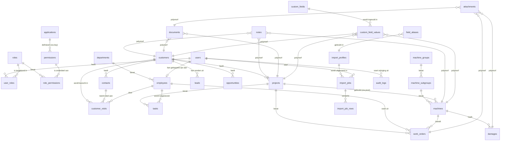

# Boels CORE PLATFORM — ERD Datamodel

**Versie:** 0.1
**Datum:** 2026-06-04
**Auteur:** Boels CORE architecture
**Host:** databasehub.sorai.nl (Antagonist)
**Database:** deb2003831_hub_database_boels

---

## 1. Doel van dit document

Dit is het visuele datamodel voor het Boels CORE Platform. Het toont alle entiteiten en hun onderlinge relaties. Op basis hiervan worden in fase 2 de tabel-, kolom- en index-specs gemaakt, en in fase 4 de Laravel migrations.

---

## 2. Domein-overzicht (high level)

Het datamodel is opgedeeld in zeven logische domeinen:

| # | Domein | Doel |
|---|---|---|
| A | **Identity & Access** | Gebruikers, rollen, permissies, applicaties |
| B | **Organisatie** | Medewerkers, afdelingen |
| C | **Klanten & Contacten** | CRM-kern: customers, contacts, leads, opportunities |
| D | **Projecten & Werk** | Projects, work_orders, tasks, customer_visits |
| E | **Vloot & Materieel** | Machine_groups, machine_subgroups, machines, damages |
| F | **Content** | Notes, documents, attachments |
| G | **Platform** | Field_aliases, custom_fields, custom_field_values, import_jobs, audit_logs |

---

## 3. ERD (Mermaid)

---

## 4. Belangrijke ontwerpkeuzes

### 4.1 Polymorfe relaties (`*_able_id` / `*_able_type`)

`notes`, `documents`, `attachments` en `custom_field_values` zijn **polymorf** gekoppeld. Dat betekent: één tabel kan aan meerdere entiteiten hangen (klant, project, machine, ...) zonder dat we steeds nieuwe tabellen hoeven aan te maken.

**Waarom:** Toekomstige apps (Schade App, Sales App, ...) krijgen automatisch notitie/documentondersteuning zonder schemawijziging.

### 4.2 RBAC volledig dynamisch

`roles` en `permissions` zijn data, geen code. Super Admin kan via UI nieuwe rollen aanmaken zoals "Fleet Manager Zuid" of "Stagiair Sales" zonder dat een ontwikkelaar iets hoeft te doen.

Permissions zijn gekoppeld aan een `application` (zoals `fleet`, `projects`) en hebben een `key` (zoals `machines.view`, `machines.edit`).

### 4.3 Application Registry

`applications` is de **enige plek** waar nieuwe Boels-apps geregistreerd worden. De Launcher leest uit deze tabel. Een app toevoegen = een rij toevoegen + permissions definiëren + rol koppelen.

### 4.4 External IDs voor synchronisatie

`customers.external_id` + `source_system` (en idem op `machines`) maakt het mogelijk om data uit bestaande Boels-systemen (bv. ERP, Salesforce, eigen DB) te importeren én later weer terug te koppelen zonder dubbele records.

### 4.5 Custom fields zonder schema-wijziging

Super Admin kan via UI velden toevoegen:
- "ATEX certificering" op machine
- "Stop nummer" op project

Geen migration nodig. Werkt via `custom_fields` (definitie) + `custom_field_values` (data).

### 4.6 Field aliases voor import

Tijdens import wordt elke kolomheader gemapped naar een interne veldnaam.

Voorbeeld: `Debiteurnaam`, `Klantnaam`, `Account Name` → allemaal `customers.customer_name`.

Onbekende headers triggeren een mapping-scherm; de mapping wordt opgeslagen en de volgende import is automatisch.

### 4.7 Audit logging + soft deletes

Alle bedrijfsentiteiten krijgen:
- `deleted_at` (soft delete — niets verdwijnt echt)
- Audit-trail via `audit_logs` tabel: wie, wanneer, oude waarde, nieuwe waarde

### 4.8 AI-ready

Alle entiteiten hebben:
- Stabiele primary keys
- Polymorfe content (notes/documents) waar AI agents semantisch kunnen zoeken
- `external_id` voor cross-system reconciliation
- Audit-logs als training-/context-bron

Een toekomstige `ai_embeddings` tabel kan eenvoudig polymorf gekoppeld worden aan elke entiteit voor RAG (Retrieval Augmented Generation).

---

## 5. Entiteit-inventaris

| # | Tabel | Domein | Soft delete | Audit | Custom fields |
|---|---|---|---|---|---|
| 1 | users | A | ✅ | ✅ | ❌ |
| 2 | roles | A | ✅ | ✅ | ❌ |
| 3 | permissions | A | ❌ | ❌ | ❌ |
| 4 | role_permissions | A | ❌ | ✅ | ❌ |
| 5 | user_roles | A | ❌ | ✅ | ❌ |
| 6 | applications | A | ✅ | ✅ | ❌ |
| 7 | departments | B | ✅ | ✅ | ❌ |
| 8 | employees | B | ✅ | ✅ | ✅ |
| 9 | customers | C | ✅ | ✅ | ✅ |
| 10 | contacts | C | ✅ | ✅ | ✅ |
| 11 | leads | C | ✅ | ✅ | ✅ |
| 12 | opportunities | C | ✅ | ✅ | ✅ |
| 13 | customer_visits | C | ✅ | ✅ | ✅ |
| 14 | projects | D | ✅ | ✅ | ✅ |
| 15 | work_orders | D | ✅ | ✅ | ✅ |
| 16 | tasks | D | ✅ | ✅ | ❌ |
| 17 | machine_groups | E | ✅ | ✅ | ❌ |
| 18 | machine_subgroups | E | ✅ | ✅ | ❌ |
| 19 | machines | E | ✅ | ✅ | ✅ |
| 20 | damages | E | ✅ | ✅ | ✅ |
| 21 | notes | F | ✅ | ✅ | ❌ |
| 22 | documents | F | ✅ | ✅ | ❌ |
| 23 | attachments | F | ✅ | ✅ | ❌ |
| 24 | field_aliases | G | ❌ | ✅ | ❌ |
| 25 | custom_fields | G | ✅ | ✅ | ❌ |
| 26 | custom_field_values | G | ❌ | ✅ | ❌ |
| 27 | import_profiles | G | ✅ | ✅ | ❌ |
| 28 | import_jobs | G | ❌ | ❌ | ❌ |
| 29 | import_job_rows | G | ❌ | ❌ | ❌ |
| 30 | audit_logs | G | ❌ | ❌ | ❌ |

**Totaal:** 30 tabellen in v1.

---

## 6. Volgende stap

Fase 2 — `docs/02-database.md` — bevat per tabel:
- Volledige kolomdefinities (type, lengte, null, default)
- Indexen
- Foreign keys
- Voorbeelddata

Daarna fase 3 (Laravel architectuur) en fase 4 (migrations).
